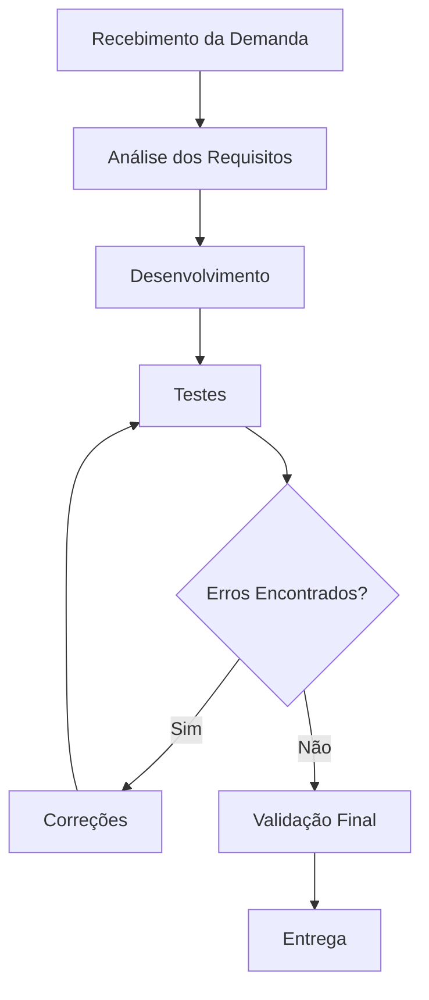

# Qualidade de Processo – LocalEats

**Equipe:** Tech Quality

**Integrante:** Gabriel Piske

**Sistema:** Local Eats (https://local-eats-unisenac.vercel.app/static/index.html)

---

## 1. Mapeamento do Processo Atual

### Fluxo do Processo

### Descrição do Processo

- A demanda é recebida pela equipe.
- Os requisitos são analisados e compreendidos.
- A funcionalidade é desenvolvida.
- São realizados testes para verificar seu funcionamento.
- Caso sejam encontrados erros, a funcionalidade retorna para correção.
- Após aprovação nos testes, ocorre a validação final.
- A funcionalidade é entregue para uso.

---

## 2. Identificação de Entradas, Atividades e Saídas

| Etapa | Entrada | Atividade | Saída |
|--------|----------|------------|--------|
| Recebimento da Demanda | Solicitação de nova funcionalidade ou correção | Registrar e analisar a demanda | Demanda documentada |
| Análise de Requisitos | Demanda documentada | Levantamento e entendimento dos requisitos | Requisitos definidos |
| Desenvolvimento | Requisitos definidos | Implementação da funcionalidade | Código desenvolvido |
| Testes | Código desenvolvido | Execução de testes manuais e automatizados | Relatório de testes |
| Correções | Defeitos identificados | Ajustes no código | Código corrigido |
| Validação Final | Código corrigido e testado | Verificação da conformidade dos requisitos | Funcionalidade aprovada |
| Entrega | Funcionalidade aprovada | Disponibilização da funcionalidade | Versão entregue |

---

## 3. Reflexão sobre o Processo

### O processo utilizado pela equipe está claramente definido?

O processo está parcialmente definido. Existem etapas conhecidas pela equipe, mas nem sempre elas são documentadas formalmente.

### Todos os integrantes seguem o mesmo fluxo de trabalho?

Nem sempre. Em alguns momentos cada integrante pode executar atividades de maneira diferente, o que pode gerar inconsistências.

### Em quais etapas a qualidade é verificada?

A qualidade é verificada principalmente durante os testes, correções e validação final. Também pode ser considerada durante a análise de requisitos e desenvolvimento.

### Quais melhorias poderiam tornar o processo mais eficiente?

- Padronização do fluxo de trabalho.
- Melhor documentação dos requisitos.
- Maior utilização de testes automatizados.
- Revisões de código antes da entrega.
- Definição clara de responsabilidades.

### Como a qualidade do processo impacta a qualidade do produto final?

Um processo bem definido reduz erros, retrabalho e atrasos. Isso aumenta a confiabilidade do software e melhora a experiência dos usuários. Quando o processo possui falhas, a tendência é que mais defeitos cheguem ao produto final.

---

## Conclusão

A equipe compreendeu que a qualidade não depende apenas dos testes ou do código desenvolvido, mas também do processo utilizado durante o desenvolvimento. Um fluxo bem estruturado contribui para reduzir defeitos, melhorar a comunicação da equipe e aumentar a qualidade das entregas realizadas no sistema LocalEats.
